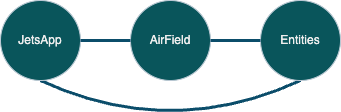

# JetsProject

## Description

An "aircraft management" type program. The program loads some data describing a small collection of jets to manage. The user is then presented with a menu of options to interact with, and modify, this collection of jets:

~~~
~~ Welcome to JetsApp!!!!! ~~

~~ Please enter an option ~~

1) List Fleet                     5) Load All Cargo Jets
2) Fly All The Jets!              6) DOGFIGHT!!!
3) List Fastest Jet(s)            7) Add Jet to Fleet
4) List Jet(s) with Longest Range 8) Remove Jet from Fleet

~~~

## Technologies Used

- Java
- Eclipse
- git
- Github

## Lessons Learned

This was our first project with enough functionality to have us start thinking about project structure. In particular, this project features two major classes: JetsApp and AirField. The data objects, the Jets, are organized into a class hierarchy and constitute the rest of the classes in the program. They reside on their own in the entities package.

I think what I learned in this project is how to have a nice separation of concerns in Java:

* JetsApp is only concerned with user interaction
    * Only sends messages to Airfield based on that interaction
    * Knows nothing about the entities package
* AirField is only concerned with managing it's data structure of Jets
    * Only receives messages from AirField, causing it to arrange and process its data according
    * Only sends messages to Jets entities
* Jet entities are only concerned with their own local behavior
    * Only receives messages from AirField, causing it to invoke its local methods
    * Knows nothing about the JetsApp class

These kinds of "X knows nothing about Y" relationships (or non-relationships, if you like), were very helpful when writing the program. Whenever I needed to add functionality as I implemented the user story, I only had to keep two parts of the program in my head at a time as I worked. The program structure made the work simple. 

Viewed more abstractly, the program structure can be viewed like a little network:

Where each node is a part of our program, which does one useful task.  Each connection between the nodes represents something like "knows about" or "makes calls to/from" or "communicates with". We can see that all the parts of the program are connected in the minimal number of ways. The alternative would be to have every part of the program know about every other part:

Relating this kind of image back to the task of programming, I have to think about more connections when writing the program. In this example, keeping three connections in mind instead of two. Which doesn't sound that bad, maybe only a little worse. 

What's interesting though, and why I think separation of concerns will be so valuable, is how the number of connections grows in each case as we increase the number of nodes, or program parts.

The minimum connections case grows linearly, given by:

~~~
min_connections(nodes) = nodes - 1
~~~

But the maximum connections case grows **quadratically**, given by:

~~~
max_connections(nodes) = (nodes * (nodes - 1)) / 2
~~~

Even for a small number like 10, we end up with 45 different connections between all the nodes when we connect them maximally.

So what did I learn?

Separation of concerns was valuable to me when writing this small project, and a little analysis says it may become **very** valuable as my programming tasks get larger. Java's classes and packages give us the tools to make that separation happen.

## Resources

Thanks to [draw.io](https://www.drawio.com/) for the free diagramming tools. 

And thanks to Wikipedia for the free knowledge about [network topologies](https://en.wikipedia.org/wiki/Network_topology).

